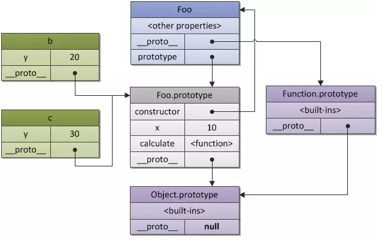

# 原型链

### 什么是原型链？
1.  JS中的每个对象，都有一个__proto__属性，这个属性就是这个对象的原型
2.  而这个对象的原型对象，也有一个__proto__属性，即该原型的原型
3.  就这样形成一条__proto__连起来的链条，递归访问__proto__到null为止，这条链条即是原型链

### 原型链解析
1.  首先，看一张图：
2.  使用构造函数Foo，创建一个实例对象f
3.  此时要分对象讨论，递归访问__proto__直到找到null为止
  - 实例对象f的原型链构成
    1.  首先找到f的原型，``f.__proto__ == Foo.prototype``
    2.  再找到Foo.protoype的原型：``Foo.prototype.__proto__ == Object.prototype``
    3.  最后找到null结束：``Object.prototype.__proto__ == null``
  - 构造函数Foo的原型链构成
    1.  首先找到Foo的原型，``Foo.__proto__ == Function.prototype``
    2.  再找到Function.protoype的原型：``Function.prototype.__proto__ == Object.prototype``
    3.  最后找到null结束：``Object.prototype.__proto__ == null``

### protoype 与 __proto__ 的区别
1.  prototype是函数才有的属性
2.  而每个对象都有__proto__属性

### __proto__ 属性指向谁
1.  当使用字面量方式创建对象
  ```js
  var a = {}
  console.log(a.constructor); // [Function: Object]
  console.log(a.__proto__ == Object.prototype); // true
  ```
2.  当使用构造函数方式创建对象
  ```js
  var A = function () {}; 
  var a = new A();
  console.log(a.constructor); // [Function: A]
  console.log(a.__proto__ == A.prototype); // true
  ```
3.  当使用Object.create方式创建对象
  ```js
  var a1 = {};
  var a2 = Object.create(a1);
  console.log(a2.constructor); // [Function: Object]
  console.log(a2.__proto__ == Object.prototype); // false
  console.log(a2.__proto__ == a1); // true
  ```

### 


