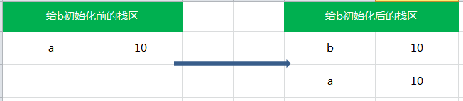
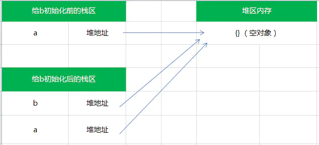

# 深拷贝和浅拷贝

### 栈和堆的区别
1.  栈：自动分配的内存空间，它由系统自动释放
2.  堆：动态分配的内存，大小不定，也不会自动释放
3.  值类型保存在栈中，而引用类型保存在堆中，变量实际上是保存在栈中的一个指针，指向堆中的地址

### 赋值操作中，传值与传址的区别
1.  值类型的传值，是在内存中新开辟一段栈内存，然后再把值赋值到新的栈中 
  ```js
  var a = 10;
  var b = a; // a 和 b 互不影响
  ```
2.  引用类型的传址，只是复制了指针，两个变量指向堆中的同一个地址 
  ```js
  var a = {}; 
  var b = a; // a 和 b 相互影响
  ```

### 浅拷贝
1.  实现
  ```js
  function shallowCopy(src) {
    var dst = {}
    for(let prop in src) {
      if(src.hasOwnProperty(prop)) {
        dst[prop] = src[prop]
      }
    }
    return dst
  }
  ```
2.  特点：重新在堆中创建内存，拷贝前后对象的基本数据类型互不影响，但对象的引用类型共享同一块内存
  ```js
  var obj1 = {
    'name' : 'zhangsan',
    'age' :  '18',
    'language' : [1,[2,3],[4,5]]
  }
  var obj2 = shallowCopy(obj1)
  obj2.name = 'lisi'
  obj2.language[1] = [9,8]
  console.log(obj1); // { name: 'zhangsan', age: '18', language: [ 1, [ 9, 8 ], [ 4, 5 ] ] }
  console.log(obj2); // { name: 'lisi', age: '18', language: [ 1, [ 9, 8 ], [ 4, 5 ] ] }
  ```

### 浅拷贝的其它实现方法
1.  Object.assign()
  ```js
  let obj1 = { person: {name: "kobe", age: 41},sports:'basketball' };
  let obj2 = Object.assign({}, obj1);
  obj2.person.name = "wade";
  obj2.sports = 'football'
  console.log(obj1);  // { person: { name: 'wade', age: 41 }, sports: 'basketball' }
  console.log(obj2); // { person: { name: 'wade', age: 41 }, sports: 'football' }
  ```
2.  展开运算符...
  ```js
  let obj1 = { name: 'Kobe', address:{x:100,y:100}};
  let obj2= {... obj1};
  obj2.name = 'wade';
  obj2.address.x = 200;
  console.log(obj1);
  console.log(obj2) ;
  ```
3.  Array.prototype.slice()
  ```js
  let arr1 = [1, 3, { username: 'kobe' }];
  let arr2 = arr1.slice();
  arr2[0] = 2;
  arr2[2].username = 'wade';
  console.log(arr1); // [ 1, 3, { username: 'wade' } ]
  console.log(arr2); // [ 2, 3, { username: 'wade' } ]
  ```

### 深拷贝
1.  实现
  ```js
  function deepClone(obj) {
    if (obj === null) return obj; 
    if (obj instanceof Date) return new Date(obj);
    if (obj instanceof RegExp) return new RegExp(obj);
    if (typeof obj !== "object") return obj;
    let cloneObj = new obj.constructor();
    for (let key in obj) {
      if (obj.hasOwnProperty(key)) {
        cloneObj[key] = deepClone(obj[key]);
      }
    }
    return cloneObj;
  }
  ```
2.  特点：从堆内存中开辟一个新的区域存放新对象，对对象中的子对象进行递归拷贝，拷贝前后的两个对象互不影响
  ```js
  let obj1 = {
    name : '浪里行舟',
    arr : [1,[2,3],4],
  };
  let obj2 = deepClone(obj1)
  obj2.name = "阿浪";
  obj2.arr[1] = [5, 6, 7] ; 
  console.log(obj1); // { name: '浪里行舟', arr: [ 1, [ 2, 3 ], 4 ] }
  console.log(obj2); // { name: '阿浪', arr: [ 1, [ 5, 6, 7 ], 4 ] }
  ```

### 深拷贝的其它实现方法
1.  JSON.parse(JSON.stringfy())：不能处理函数和正则
  ```js
  let obj1 = {
    name: 'zhangsan',
    type: {
      game: 'xiake',
      id: 5
    }
  }
  let obj2 = JSON.parse(JSON.stringify(obj1));
  obj2.name = 'lisi';
  obj2.type.game = 'wuxia';
  console.log(obj1); // { name: 'zhangsan', type: { game: 'xiake', id: 5 } }
  console.log(obj2); // { name: 'lisi', type: { game: 'wuxia', id: 5 } }
  ```

### 赋值、浅拷贝与深拷贝的区别
              和原数据是否指向同一对象          原数据中的值类型            原数据中的引用类型
赋值                  是                       改变会影响原数据             改变会影响原数据    
浅拷贝                否                       改变不会影响原数据           改变会影响原数据    
深拷贝                否                       改变不会影响原数据           改变不会影响原数据

### 