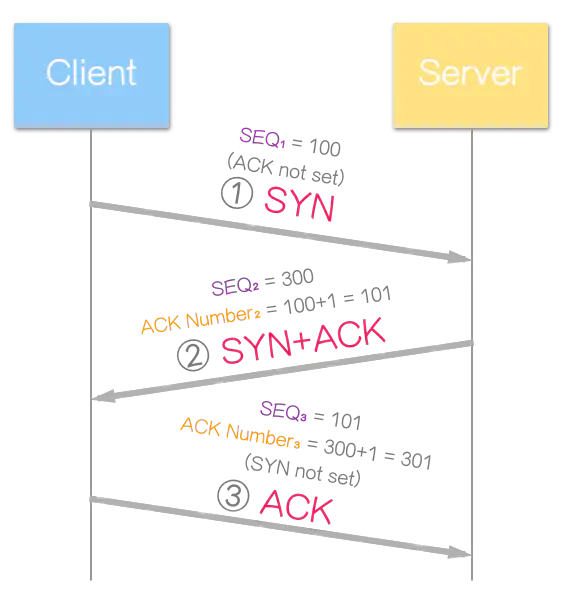

# TCP三握四挥：https://juejin.im/post/5d9c284b518825095879e7a5

### TCP三次握手
1.  什么是三次握手：建立一个TCP连接时，需要客户端和服务器总共发送3个包
2.  三次握手的目的：连接服务器指定端口，建立TCP连接，并同步双方的序列号和确认号，交换TCP窗口大小信息
3.  辅助理解图：
4.  过程：
  1.  客户端发送一个SYN=1的包，并置数据序号Seq为X
    - 发送后，客户端进入 SYN_SENT 状态
  2.  服务端发回一个确认包应答，SYN和ACK标志位均为1，并置数据序号Seq为Y，确认序号Ack为X+1
    - 发送后，服务端进入 SYN_RECEIVED 状态
  3.  客户端再次发回一个确认包应答，ACK标志位为1，并置数据序号为X+1，确认序号为Y+1
    - 客户端发送后，进入 ESTABLISHED 状态，服务端收到后，也进入 ESTABLISHED 状态

### 为什么是三次握手，不是两次？
